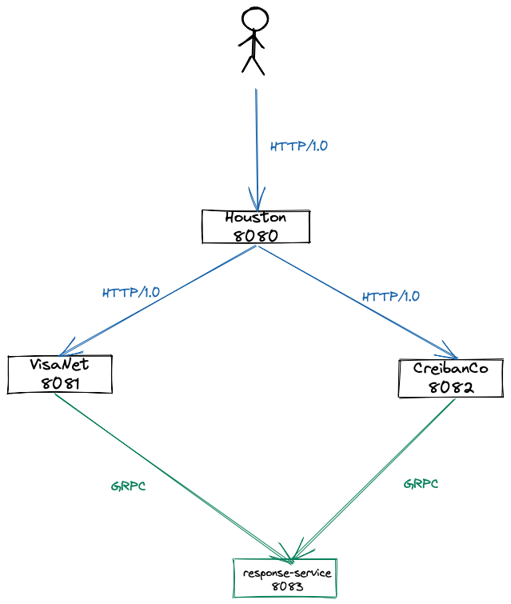
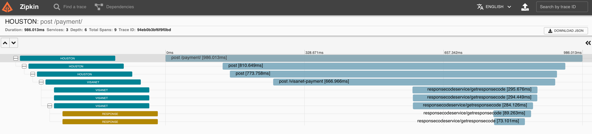

# PayU gRPC

PayU gRPC simple project.

## Project Structure

1. Houston: Main project (Rest API) for accepting payment requests.
2. VisaNet: Payment Network (Rest API) for processing Perú payment requests.
3. CredibanCo: Payment Network (Rest API) for processing Colombia payment requests.
4. response-service: gRPC server for generate response codes



### Setup

- Clone this repository

```
 git clone https://github.com/guedim/grpc
```

- Move to the directory `grpc-payu-demo`

```
cd grpc/grpc-payu-demo
```

### Build project & Docker images

- To build all services docker images (Houston, VisaNet, CredibanCo, response-service) run next command:

```
docker-compose build
```


### Start services

For create, start and attach all containers, please run next docker-compose command:

```
 docker-compose up
```

### Test services

Finally, ``Houston`` expose one endpoint:
- ``/payment/``: POST http method for processing payment requests.

For testing VisaNet, run next command:

```
curl --location --request POST 'http://localhost:8080/payment/' \
--header 'Content-type: application/json' \
--data-raw '{
    "paymentNetwork": "VISANET", 
    "value": 100
}'
```

For testing CredibanCo, run next command:
```
 curl --location --request POST 'http://localhost:8080/payment/' \
--header 'Content-type: application/json' \
--data-raw '{
    "paymentNetwork": "CREDIBANCO", 
    "value": 100
}'
```

Open a browser in  ``http://localhost:9451`` and see tracing differences for Rest and gRPC services.



# References

For further reference, please consider the following sections:

- https://grpc.io/
- https://github.com/grpc
- https://github.com/LogNet/grpc-spring-boot-starter
- https://grpc.io/docs/what-is-grpc/core-concepts/
- https://naspers.udemy.com/course/grpc-golang/
- https://www.udemy.com/course/grpc-the-complete-guide-for-java-developers/
- https://github.com/uw-labs/bloomrpc
- https://ecm.capitalone.com/WCM/tech/grpc-3.png

